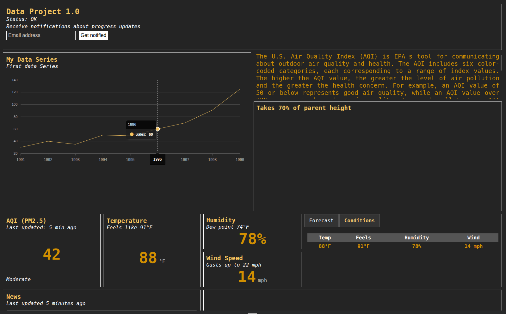
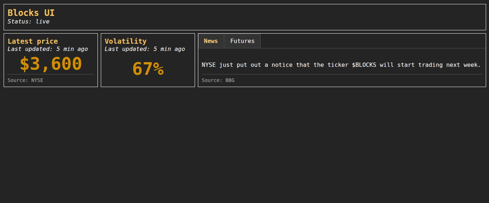

# Blocks UI

## A ligthweight UI framework to visualize data



## Installation
1. CDN installation:

Add this line in your `<head>`
```html
<link rel="stylesheet" href="https://cdn.hudsonshipping.co/blocks.min.css">
```

2. Download the `blocks.min.css` and `blocks.js` files locally and import them directly:
```html
<link rel="stylesheet" href="./path_to_static/blocks.min.css">
<script src="./path_to_static/blocks.js"></script>
```

## Quickstart
```html
<html>
<!-- See above for imports in the <head> -->
<body>
<div class="blockrow">
    <div class="block-100">
        <div class="title-lg">Blocks UI</div>
        <div class="subtitle">Status: live</div>
    </div>
</div>

<div class="blockrow">
    <div class="block-lg-20 block-md-40">
        <div class="title">Latest price</div>
        <div class="subtitle">Last updated: 5 min ago
        </div>
        <div class="number">$3,600</div>
        <div class="footer">Source: NYSE</div>
    </div>
    <div class="block-lg-20 block-md-40">
        <div class="title">Volatility</div>
        <div class="subtitle">Last updated: 5 min ago</div>
        <div class="number">67%</div>
    </div>
    <div class="block-lg-60 block-md-100 tab-block">
        <div class="tabs">
            <a href="#tab1" class="tab active">News</a>
            <a href="#tab2" class="tab">Futures</a>
        </div>
        <div id="tab1" class="tab-content">
            <p>NYSE just put out a notice that the ticker $BLOCKS will start trading next week.</p>
            <div class="footer">Source: BBG</div>

        </div>
        <div id="tab2" class="tab-content">
            <table>
                <thead>
                <tr>
                    <th scope="col">BLOCKS</th>
                    <th scope="col">HNEWS</th>
                    <th scope="col">GITHUB</th>
                    <th scope="col">HSC</th>
                </tr>
                </thead>
                <tbody>
                <tr>
                    <th scope="row">+5%</th>
                    <th>+4%</th>
                    <th>-5%</th>
                    <th>+12%</th>
                </tr>
                </tbody>
            </table>
        </div>
    </div>
</div>
</html>
```
This will create a simple blocks UI:


## Motivation
There is simply no library today that is a light CSS/JS library that can help with
the visualization of data. There are many frameworks today that can display
beautiful dashboards, but they are either bloated, slow or simply not data specific.

`Blocks UI` allows you to display your data is different blocks. Each block has:
- A title
- A subtitle (optional)
- Tabs (optional)
- A body
- A footer (optional)

A block body can contain:
- Another block
- Text
- A chart
- A number
- Plain HTML

## Features

### Disclaimer
This library was originally built by hand, and I've recently picked it back up and use some LLM tools to help me move it
along at a faster pace. All reviews are manual, but please use carefully.
